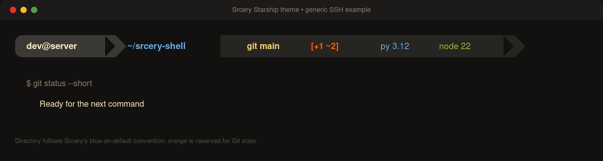

# Starship theme



Copy `starship.toml` to Starship's default configuration path:

```sh
mkdir -p ~/.config
cp starship.toml ~/.config/starship.toml
```

The theme uses powerline and language glyphs, so a Nerd Font is recommended.

The palette follows the [canonical Srcery palette](https://github.com/srcery-colors/srcery-palette).
