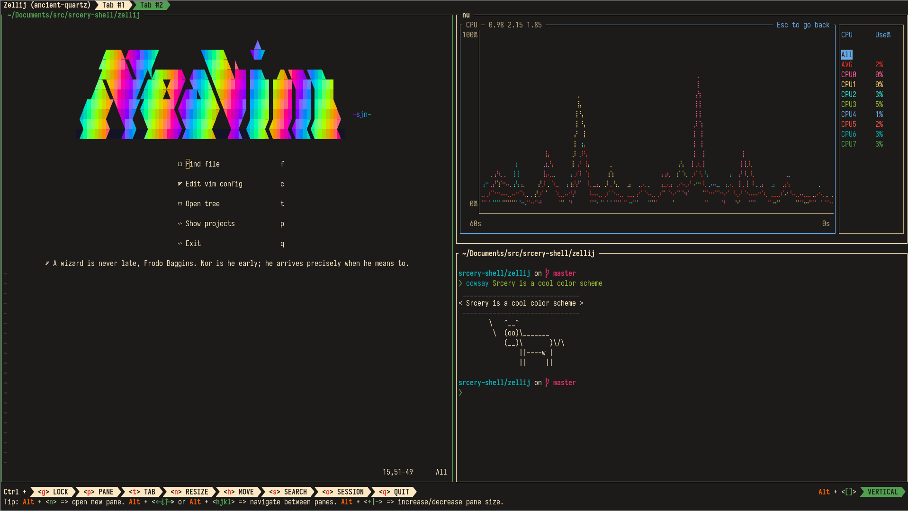

# Zellij theme

To install the srcery zellij theme, copy the `srcery.kdl` file to the
`theme_dir` path (defaults to `~/.config/zellij/themes` on linux). Afterward
set the theme variable in the zellij config to `srcery`.

# Images

